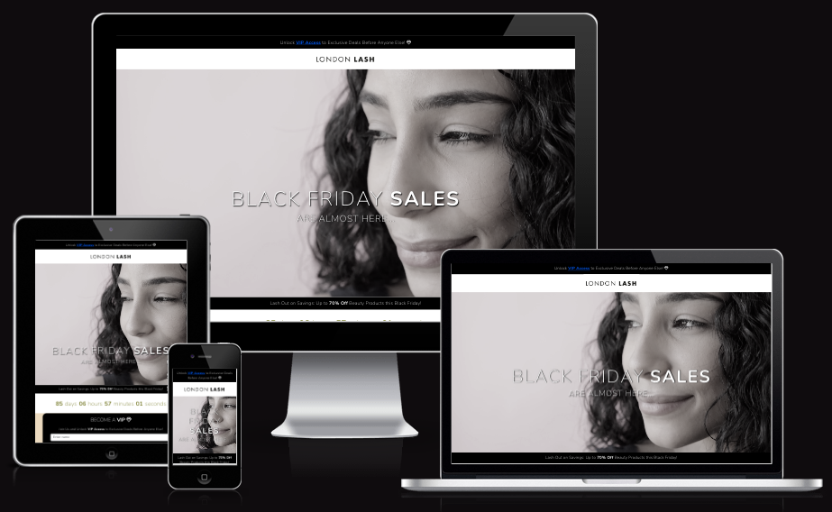

BLACK FRIDAY SALES LANDING PAGE - LONDON LASH PRO
==================================

* * *

ABOUT THE WEBSITE:
------------------

* * * 

[DEPLOYED SITE HEROKU LINK](https://blackfriday-londonlash-7d12788698f6.herokuapp.com/)

[DEPLOYED FRONTEND HEROKU LINK - LIVE SITE](https://instantes-react.herokuapp.com/)

_BLACK FRIDAY SALES Landing Page_ was created for London Lash Pro.

The landing page aligns with London Lash Pro's website aesthetics, featuring the same color palette and a font resembling Futura PT (licensed through Adobe). It boasts a minimalist yet interactive design, including advertising banners, a simulated navigation bar with the logo, a striking hero image with animated promotional text, a countdown timer, and a user-friendly sign-up form.

* * * 

TARGET AUDIENCE
------------------

* * *

London Lash Pro, as a company specializing in eyelash and beauty products and services, would typically target the following audience:

1. Beauty Professional
2. Salon and Spa Owners
3. Individual Lash Technicians
4. Beauty Enthusiasts
5. Training and Education Seekers
6. E-commerce Shoppers
7. International Markets

  
* * *

STRUCTURE:
---------

* * *
This landing page was created using React. It is composed by several Components which are rendered. The components include:

1. Advertising banners.
2. A simulated navigation bar with the logo. 
3. Landing Page Image: striking hero image with.
4. Animated promotional text which is displayed over the Hero. 
4. Countdown timer.
5. User-friendly sign-up form.

* * * 

COLORS:
---------

* * *

The color scheme used for this project were inspired by London Lash Pro's color pallette used in their website.
I used a little more black in the landing page as it feed into the Black Sales Theme. For example: alert banners, hero video, VIP sign up form.

* * * 
TYPOGRAPHY:
---------

* * *

The Typography used by London Lash is FUTURA PT which is purchased by Adobe.
As I do not hold a license, for the purpose of this project I used Nunito, which is Google Fonts equivalent.

I also made use on the play of font-weight as used in the logo. Important words that are meant to stand out to the customers are in BOLD. 

Headers are uppercased and letter spacing is increased.

Font awesome icons were added, also inspired by the website. In this case I used the free ones, which can be replaced by the colored emoji's once purchased. 

* * * 
