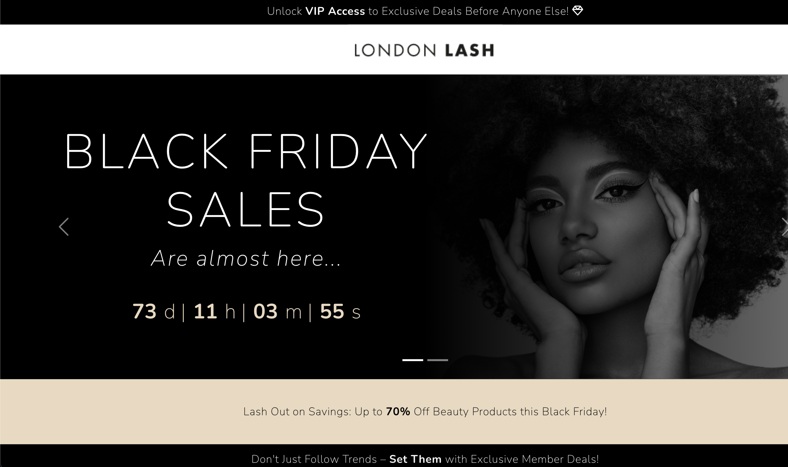

London Lash Pro: Black Friday Sales Landing
=================================================

* * *

ABOUT THE WEBSITE:
------------------

* * * 

[DEPLOYED SITE HEROKU LINK](https://blackfriday-londonlash-7d12788698f6.herokuapp.com/)
[GitHub Link](https://github.com/stephaniecrocker91/blackfriday)

_BLACK FRIDAY SALES Landing Page_ was created for London Lash Pro using React.

The landing page aligns with London Lash Pro's website aesthetics, featuring the same color palette and a font resembling Futura PT (licensed through Adobe). It boasts a minimalist yet interactive design, including advertising banners, a simulated navigation bar with the logo, a striking hero image with animated promotional text, a countdown timer, and a user-friendly sign-up form.

It is fully responsive for both desktop and mobile.

* * * 

TARGET AUDIENCE
------------------

* * *

London Lash Pro, as a company specializing in eyelash and beauty products and services, would typically target the following audience:

1. Beauty Professional
2. Salon and Spa Owners
3. Individual Lash Technicians
4. Beauty Enthusiasts
5. Training and Education Seekers
6. E-commerce Shoppers
7. International Markets

  
* * *

STRUCTURE:
---------

* * *
This landing page was created using React. It is composed by several Components which are rendered. The components include:

1. Advertising banners.
2. A simulated navigation bar with the logo. 
3. Landing Page Image: striking hero image with.
4. Animated promotional text which is displayed over the Hero. 
4. Countdown timer.
5. User-friendly sign-up form.

* * * 

COLORS:
---------

* * *

The project's color scheme drew inspiration from London Lash Pro's minimalist and clean palette featured on their website. 

To align with the Black Friday Sales theme, I incorporated a subtle infusion of black throughout the landing page. For instance, this can be seen in alert banners and black-and-white imagery.

* * * 
TYPOGRAPHY:
---------

* * *

London Lash employs the FUTURA PT typography, acquired through Adobe licensing. However, for this project, I utilized the Google Fonts equivalent, Nunito, due to licensing constraints. 

To enhance customer engagement, I employed bold formatting for key terms, capitalized headers, and increased letter spacing. 

Additionally, Font Awesome icons were integrated, mirroring the website's design, with the intention to replace them with colored emojis upon acquisition.

* * * 
